<p align="center">
  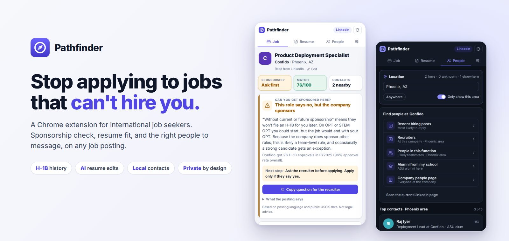
</p>

<p align="center">
  
  
  
  
  
</p>

<h3 align="center">A Chrome extension for international job seekers.<br>On any job posting: can they sponsor you, does your resume fit, and who should you message?</h3>

---

## The problem

International students on OPT are job hunting against a clock: OPT allows only a limited number of unemployment days. Yet most of their time goes to three things that don't work:

| | What happens today | Why it hurts |
|---|---|---|
| 🛂 | **Applying to jobs that can't sponsor them.** Postings are vague ("no sponsorship"? "future sponsorship"?) or silent. | Hours tailoring resumes for jobs that were never possible. |
| 📄 | **Sending the same resume everywhere.** Applicant tracking systems filter by keywords this job needs. | Hundreds of applications, almost no interviews. |
| 🤝 | **Messaging random strangers on LinkedIn.** There's no way to tell who is active, hiring, or local. | Cold messages go unanswered, with no path to a referral. |

The answers already exist: sponsorship history is public USCIS data, the job description lists the keywords, and LinkedIn shows who's active. **They're just scattered.** Pathfinder brings them into one side panel, on the page you're already looking at.

---

## See it in action

<p align="center">
  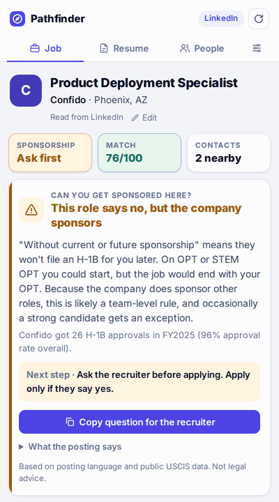
</p>

---

## Features

### 1. Sponsorship verdict, not just a keyword match
Pathfinder reads the posting **and** checks the company's real H-1B filings from USCIS, then gives one clear answer: **Likely yes**, **Ask first**, or **Skip**, with the reason and the next step.

| Verdict | H-1B history |
|---|---|
| 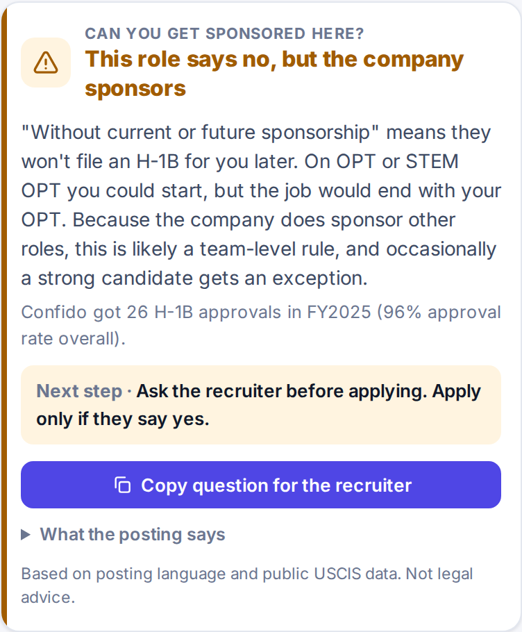 | 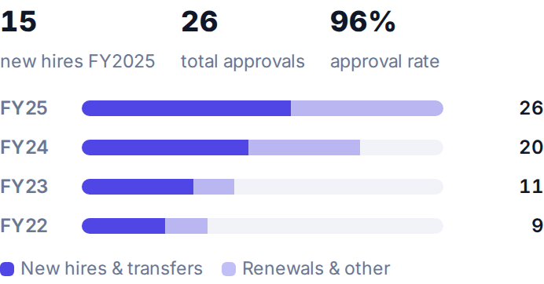 |

- Tells apart **"no sponsorship, now or later"**, a **vague "no sponsorship"**, and **legal blockers** (clearance, citizenship).
- Spots the hidden opportunity: *the posting says no, but the company sponsors hundreds a year*. It suggests asking the recruiter and gives you the exact question to copy.
- Shows new hires vs. renewals by year, the approval rate, and links to H1BGrader and MyVisaJobs.

### 2. Resume match + AI edits
| Match score | Line-by-line edits |
|---|---|
| 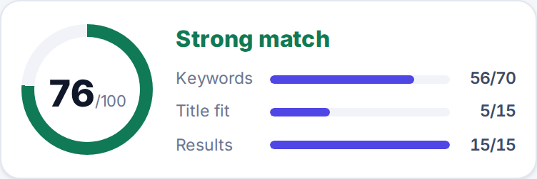 | 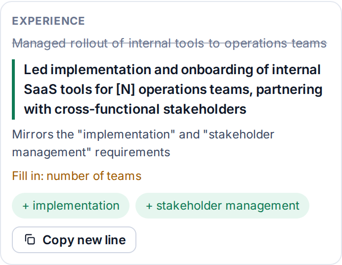 |

- Scores your resume against **this** job: keywords (70), title fit (15), and measurable results (15).
- Shows **missing** keywords (required ones flagged) and **matched** ones.
- **Suggest edits** gives "change this line → to this" edits from Claude, mirroring the job's exact wording.
- **It never invents experience.** Edits only reword what's on your resume, use `[X%]` placeholders where a real number would help, and flag any line it can't find in your resume.

### 3. The right people, in your city, with a message that sounds human
| Location picker | AI-written LinkedIn message |
|---|---|
| 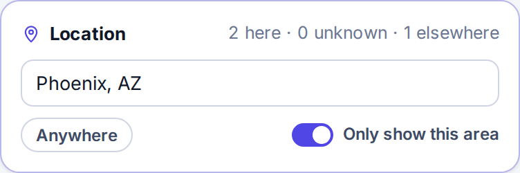 | 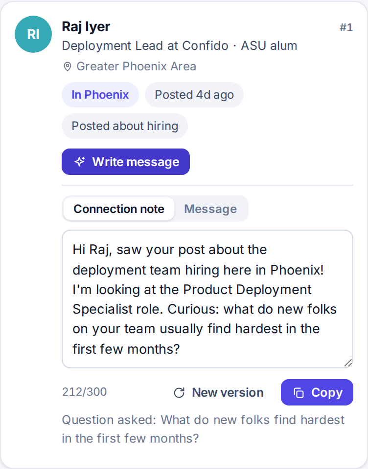 |

- One-click LinkedIn searches: **recent hiring posts**, **recruiters**, **people in this function**, **alumni from your school**.
- Ranks everyone you scroll past by **location** (it understands metros: "Phoenix" includes Tempe, Scottsdale and Chandler), recent activity, hiring posts, role fit, and shared school, country or employer.
- **Write message** fills a DM template with the person's role, a shared connection, and the job, then writes:
  - a **connection note** (with a live 300-character counter)
  - a **4–6 sentence message** that asks one smart question, with no bragging and no desperation
- You edit and send it yourself. **Pathfinder never sends anything automatically.**

### At a glance


Every job gets three tiles: **Sponsorship · Match · Contacts**. Tap one to jump to the details.

---

## How it works

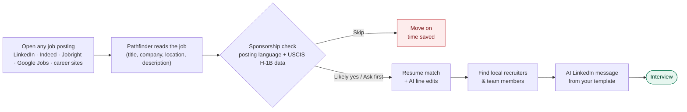

---

## Works on

| Job boards | Applicant tracking systems | Anything else |
|---|---|---|
| LinkedIn · Indeed · Jobright · Google Jobs · Glassdoor · ZipRecruiter · Dice · Wellfound · Handshake | Greenhouse · Lever · Workday · Ashby · SmartRecruiters · iCIMS | Most company career pages, via the schema.org `JobPosting` data they publish for Google. Or highlight the job description and click **Use highlighted text**. |

---

## Install

> Pathfinder is in beta and installs in Chrome's developer mode. A Chrome Web Store release is planned.

1. **Download** this repo: green **Code** button → **Download ZIP**, then unzip it.
2. Open `chrome://extensions` and turn on **Developer mode** (top right).
3. Click **Load unpacked** and select the **`pathfinder`** folder (the one with `manifest.json` inside).
4. Pin the extension (puzzle icon → pin), open any job posting, and click the Pathfinder icon.

### Setup (Settings tab, about 5 minutes)
| Setting | Why | Notes |
|---|---|---|
| **Resume** | Match score and AI edits | PDF, .docx or .txt. Stays in your browser. |
| **School, country, past employers** | Ranks people who share your background | Optional |
| **My background in one sentence** | Personalizes LinkedIn messages | e.g. *"Ops analyst moving into product work"* |
| **Claude API key** | AI edits and AI messages | Optional. Create one at [console.anthropic.com](https://console.anthropic.com). Costs a few cents per use. |
| **H-1B data** | Sponsorship history | Download recent fiscal-year CSVs from the [USCIS H-1B Employer Data Hub](https://www.uscis.gov/tools/reports-and-studies/h-1b-employer-data-hub) and import them once. |

---

## Privacy by design

- **No servers, no accounts, no tracking.** The resume, settings, H-1B data and usage metrics live in your browser (`chrome.storage.local`).
- Job and resume text go to Anthropic's Claude API **only** when you click **Suggest edits** or **Write message**, using your own key.
- Pathfinder **only reads pages you're viewing**. No bulk scraping, no auto-messaging, no automation on LinkedIn.
- **Clear all data** in Settings deletes everything.

Full policy: [docs/PRIVACY.md](docs/PRIVACY.md)

---

## Architecture

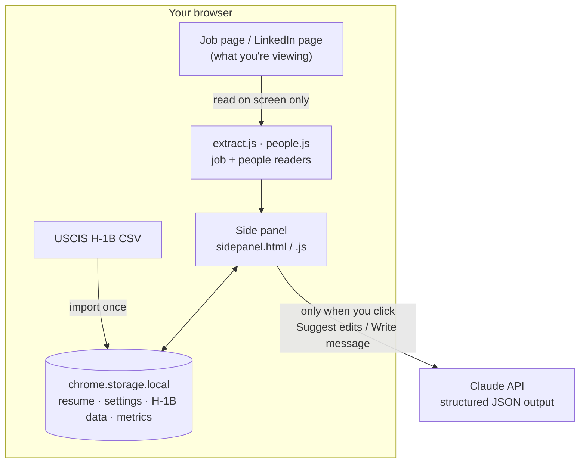

| File | What it does |
|---|---|
| `manifest.json` | Chrome Manifest V3 config and permissions |
| `extract.js` | Universal job reader: site adapters → JSON-LD → Next.js data → heuristics |
| `sponsorship.js` · `verdict.js` | Reads sponsorship language and combines it with H-1B history into a verdict |
| `h1b.js` | Imports USCIS CSVs (both formats), matches company names ("Google" = "GOOGLE LLC") |
| `resume.js` | Reads PDF/Word resumes locally (pdf.js, mammoth) and scores them |
| `people.js` · `location.js` | Reads LinkedIn people, ranks by activity and fit, matches metro areas |
| `prompts.js` | **All AI prompts**, including the LinkedIn DM template. Edit these to tune the AI. |
| `ai.js` | Claude API calls with JSON-schema structured output and clear error handling |
| `sidepanel.*` | The UI: Job, Resume, People and Settings tabs, light and dark mode |

---

## Light and dark mode

| Job | Resume | People |
|---|---|---|
| 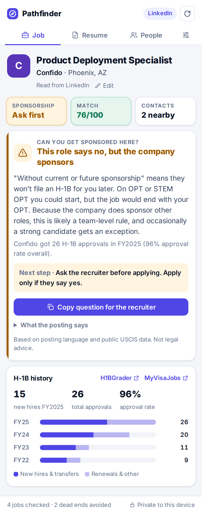 | 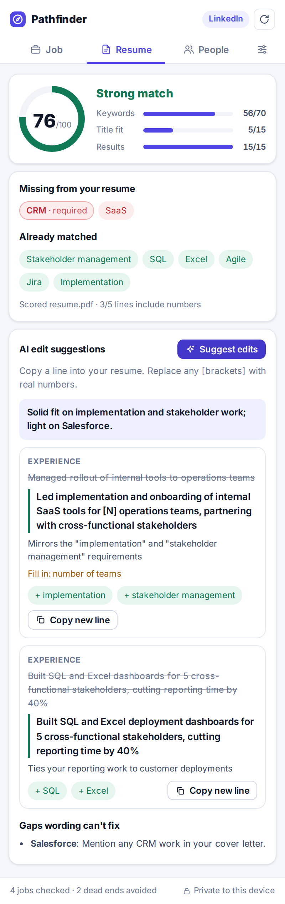 | 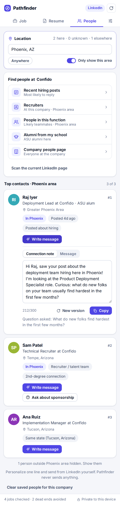 |
| 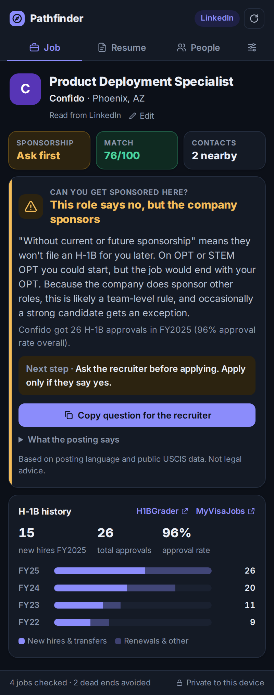 | 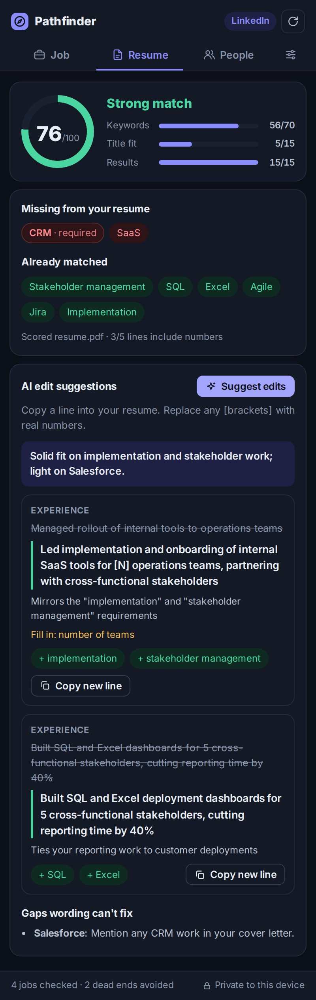 | 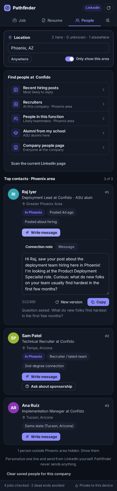 |

---

## Impact metrics (built in)

Pathfinder measures whether it changes outcomes, not just whether people click. **Settings → Copy metrics** exports:

| Metric | What it shows |
|---|---|
| Jobs checked, by site | Where people actually job hunt |
| Dead ends avoided | Jobs skipped thanks to the sponsorship verdict |
| Average match score | Resume fit over time |
| AI edits copied | Whether suggestions are actually used |
| Messages drafted / edited / copied | Outreach volume and how much people personalize |
| Visa questions asked | Recruiter conversations started |

---

## Development

```bash
npm install
npm test        # 50 tests: job readers for 9 sites, H-1B parsing, verdicts, scoring, location matching, full panel flows
npm run package # zips the extension for upload
```

## Roadmap

- [x] Job readers for major job boards, ATS platforms and career pages
- [x] Sponsorship verdict + USCIS H-1B history
- [x] Resume score + AI line edits
- [x] Location-aware people finder + AI LinkedIn messages
- [ ] Built-in H-1B data (no CSV import)
- [ ] Hosted AI (no personal API key needed)
- [ ] Outreach tracker: sent → replied → referred → interview
- [ ] OPT unemployment-day tracker
- [ ] Chrome Web Store release

## Disclaimer

Pathfinder gives guidance based on job posting language and public USCIS data. **It is not legal or immigration advice.** Always confirm sponsorship with the employer.

---

<p align="center"><sub>Built for everyone who's applied to 200 jobs and heard back from 3.</sub></p>
